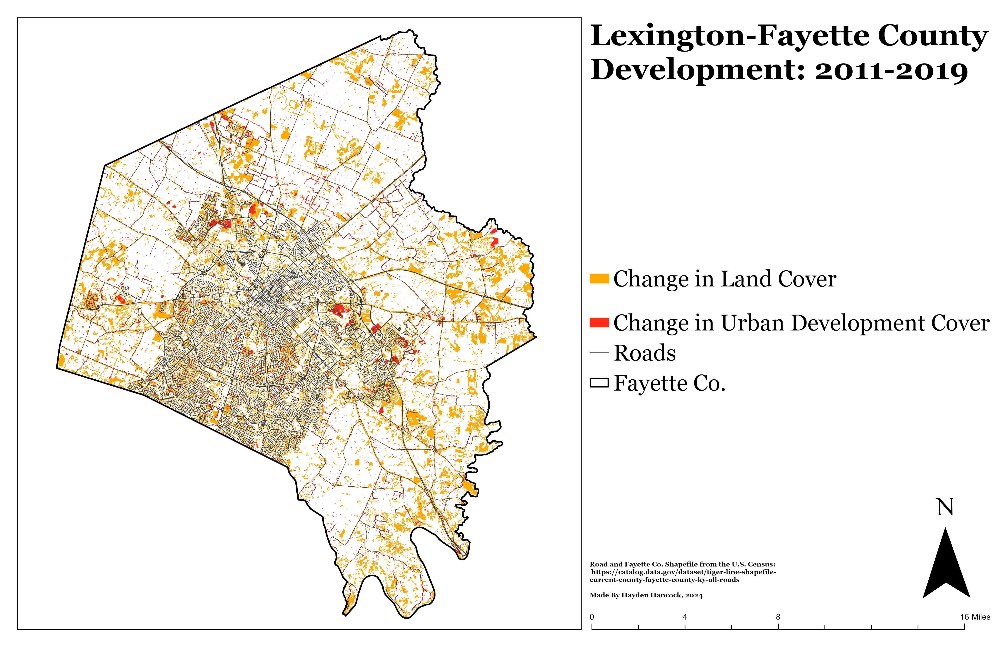

# Lexington: 2011 to 2019
## This map shows change of 30x30m pixels of Land Cover Classifications

Lexington has seen an impressive amount of growth in the past decade. Most of what is shown on the map is outside New Circle Road. There is likely more development that could be seen in the inner city by comparing Digital Surface Models as opposed to using Land Cover.

     
*Lexington_Land_Cover_Change*

[Link to high-resolution version](Layout.pdf)     

Imagery taken by KyFromAbove. 
